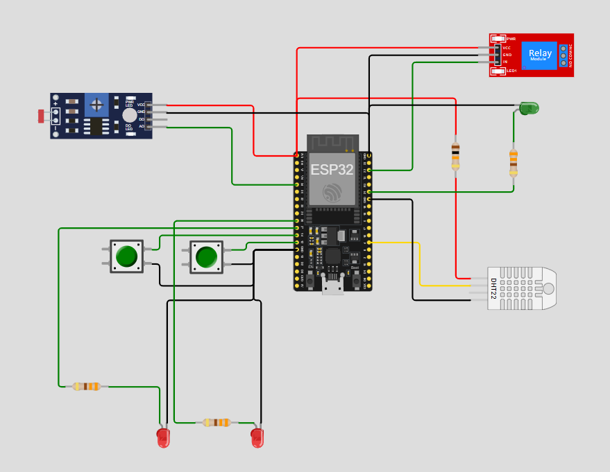

# FIAP - Faculdade de Informática e Administração Paulista

<p align="center">
<a href= "https://www.fiap.com.br/"></a>
</p>

<br>

# Sistema de Sensoriamento Agrícola - FarmTech Solutions

## Integrantes: 
- <a href="https://www.linkedin.com/in/joseandrefilho">Jose Andre Filho</a>

## Professores:
### Tutor 
- <a href="https://www.linkedin.com/in/lucas-gomes-moreira-15a8452a/">Lucas Gomes Moreira</a>
### Coordenador
- <a href="https://www.linkedin.com/in/profandregodoi/">André Godoi Chiovato</a>


## Descrição do Projeto

# Projeto FarmTech Solutions

O projeto **FarmTech Solutions** visa desenvolver um sistema de monitoramento e controle inteligente para a irrigação e o manejo de culturas agrícolas, utilizando um **ESP32** e sensores simulados no ambiente [Wokwi](https://wokwi.com/). Este sistema coleta dados ambientais relevantes — como umidade do solo, níveis de nutrientes (P e K) e valores de pH — permitindo decisões automatizadas e eficientes para o controle de irrigação e aplicação de fertilizantes, promovendo o uso otimizado de recursos.

## Funcionalidades
- **Monitoramento em Tempo Real**: Coleta contínua de dados do solo, incluindo medições de umidade (sensor DHT22), pH (simulado pelo sensor LDR) e nutrientes (simulados por botões), oferecendo uma visão precisa das condições de cultivo.
- **Controle Automatizado de Irrigação**: Acionamento de um relé para controle da bomba d’água, ajustando a quantidade de água com base nos dados coletados para manter as condições ideais do solo.
- **Geração de Alertas**: Emissão automática de alertas quando os parâmetros do solo (umidade, pH, nutrientes) ultrapassam os limites recomendados, permitindo ajustes imediatos nas condições do cultivo.
- **Integração com Banco de Dados e MQTT**: Transmissão dos dados via MQTT para um sistema Python, que grava as informações em um banco de dados Oracle, possibilitando consultas históricas e análises preditivas.
- **Gestão de Culturas**: Cadastro e acompanhamento das plantações e suas necessidades específicas, permitindo que o produtor visualize dados históricos e entenda melhor as demandas de cada cultura.
- **Previsão de Necessidades**: Análise de dados históricos para prever futuras demandas de irrigação e fertilização, proporcionando um manejo mais eficiente dos recursos agrícolas e auxiliando na tomada de decisões agronômicas.

Este sistema proporciona ao produtor uma ferramenta integrada para acompanhar, em tempo real, as condições do solo e das culturas, além de garantir um uso racional de água e nutrientes.


## Arquitetura e Tecnologias Utilizadas

### Arquitetura do Sistema
O fluxo de dados no sistema é realizado da seguinte forma:
1. **Coleta de Dados no Circuito ESP32**: Utilizando sensores conectados ao ESP32 em uma simulação no Wokwi.
2. **Comunicação via MQTT**: Dados são enviados do ESP32 para o sistema Python através do protocolo MQTT.
3. **Banco de Dados Oracle**: O sistema armazena e manipula os dados em um banco de dados Oracle em nuvem.
<!-- 4. **Análise e Visualização (Opcional)**: O sistema pode gerar dashboards e realizar análise de dados em R. -->

### Tecnologias
- **Wokwi/ESP32**: Simulação do circuito com sensores de umidade, LDR para pH, e botões para nutrientes.
- **Paho MQTT**: Protocolo de comunicação para integração de dados.
- **Python e Oracle SQL**: Consumo de dados e operações CRUD no banco de dados.
<!-- - **R e Streamlit**: Análise de dados e visualização em dashboards (opcional). -->

## Estrutura de pastas

Dentre os arquivos e pastas presentes na raiz do projeto, definem-se:

- **assets**: Contém imagens e outros arquivos de mídia não estruturados relacionados ao projeto.
- **mer**: Diretório que contém o arquivo do Modelo Entidade Relacionamento (MER), Diagrama Entidade Relacionamento (DER), arquivo de Definição de Dados (DDL), gerados pela ferramenta **Oracle SQL Developer Data Modeler** e o README com a documentação do Modelo de Dados.
- **src**: Diretório que contém o código fonte do projeto, arquivos de configuração e demais recursos necessários para a execução do sistema.
- **wokwi**: Diretório que contém o código fonte do projeto do Wokwi para simulação e o README com a documentação do circuito.
- **README.md**: Arquivo de guia e explicação geral sobre o projeto (este que você está lendo agora).

## Como executar o projeto
Para executar o projeto de forma completa e integrada, é importante configurar corretamente o ambiente e as dependências necessárias. Este guia irá orientá-lo em cada etapa para garantir o funcionamento ideal, desde a configuração do banco de dados até a execução local e a simulação no Wokwi. Certifique-se de seguir os passos abaixo para instalar e configurar todos os recursos que o sistema precisa.

### Etapas para preparar e executar o projeto:

1. **Clone o repositório**:
   Primeiro, faça o clone do repositório do projeto em seu ambiente local:
   ```bash
   git clone https://github.com/joseandrefilho/1TIAOR20242_FASE3_CAP1.git
   cd 1TIAOR20242_FASE3_CAP1
   ```

2. **Configuração do Banco de Dados**:
   Para criar as tabelas necessárias, execute os scripts SQL disponíveis na pasta `mer`:
   - No Oracle SQL Developer, execute o script `FarmTech_SCRIPT_DDL.sql` para criar o banco de dados e `FarmTech_SCRIPT_SampleData.sql` para inclusão dos registros iniciais de cultura e sensores.
   - Detalhes adicionais estão disponíveis no [README](mer/README.md) da pasta `mer`.

3. **Configurar variáveis de ambiente**:
   Crie um arquivo `.env` na raiz do projeto com as credenciais de acesso ao banco de dados Oracle:

   ```bash
   DB_USER=seu_usuario
   DB_PASSWORD=sua_senha
   DB_DSN=seu_dsn
   ```

4. **Instale as dependências**:
   Na raiz do projeto, instale as dependências listadas no arquivo `requirements.txt`:
   ```bash
   pip install -r requirements.txt
   ```

5. **Execute o projeto localmente**:
   Inicie o sistema rodando o arquivo `main.py` na pasta `src`:
   ```bash
   python src/main.py
   ```

6. **Execute o projeto no Wokwi**:
   Você pode visualizar e interagir com a simulação do projeto no Wokwi clicando na imagem abaixo:

   [](https://wokwi.com/projects/413777804461865985)

   Ou clique diretamente [aqui](https://wokwi.com/projects/413777804461865985) para acessar a simulação.
   
Detalhes adicionais estão disponíveis no [README](mer/README.md) da pasta `wokwi`.

## Vídeo de Apresentação

O vídeo de apresentação do projeto está disponível no YouTube, no link abaixo:

[](https://www.youtube.com/watch?v=oRkBaxGQaf0)


## Histórico de lançamentos
* 0.3.0 - 10/11/2024
    * Atualização do README com instruções detalhadas para execução.

* 0.2.0 - 08/11/2024
    * Adição do MER/DER e do script DDL para criação do banco de dados Oracle.
    * Adição de entidades no banco de dados para sensores, culturas, leituras e alertas.
    * Integração inicial com o cliente MQTT para receber dados simulados.
    * Criação do código para integração com o banco de dados e recepção de dados via MQTT.

* 0.1.1 - 07/11/2024
    * Revisão do README com detalhes sobre as tecnologias utilizadas.
    * Documentação inicial sobre a configuração do ambiente.
    * Ajustes no código para organização das pastas `src`, `mer`, e `wokwi`.

* 0.1.0 - 12/10/2024
    * Criação inicial do MER/DER com entidades básicas e relacionamentos.
    * Adição do README.md com estrutura de pastas e introdução ao projeto.
    * Criação do código base para configuração inicial do sistema.

* 0.0.1 - 10/10/2024
    * Criação do repositório e início do desenvolvimento do projeto.
    * Planejamento do escopo inicial e definição de objetivos.
    * Estrutura inicial do código e organização dos arquivos do projeto.


## Licença

<p xmlns:cc="http://creativecommons.org/ns#" xmlns:dct="http://purl.org/dc/terms/"><a property="dct:title" rel="cc:attributionURL" href="https://github.com/agodoi/template">MODELO GIT FIAP</a> por <a rel="cc:attributionURL dct:creator" property="cc:attributionName" href="https://fiap.com.br">Fiap</a> está licenciado sobre <a href="http://creativecommons.org/licenses/by/4.0/?ref=chooser-v1" target="_blank" rel="license noopener noreferrer" style="display:inline-block;">Attribution 4.0 International</a>.</p>

