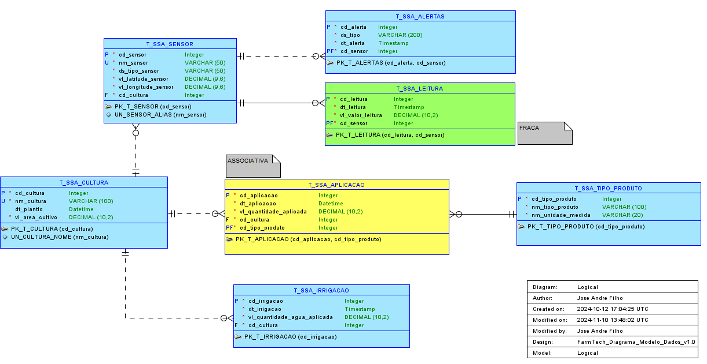
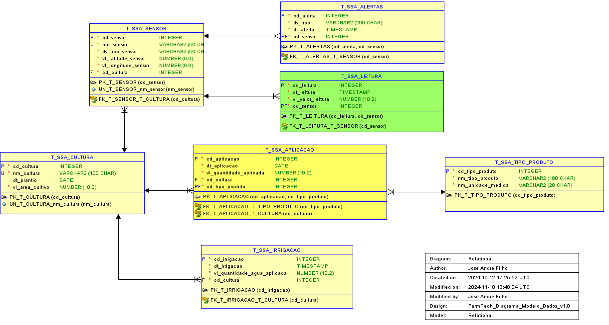

# FIAP - Faculdade de Informática e Administração Paulista

 

# Modelagem de Banco de Dados: MER, DER e Script DDL para Sistema de Sensoriamento Agrícola

## Descrição

Este repositório contém os arquivos do **Modelo Entidade-Relacionamento (MER)**, o **Diagrama Entidade-Relacionamento (DER)**, e o **Script DDL** do sistema de sensoriamento agrícola **FarmTech Solutions**. O MER, DER e o Script DDL foram gerados utilizando as ferramentas **Oracle SQL Developer Data Modeler**, refletindo a estrutura e os relacionamentos das entidades do banco de dados.

O objetivo do MER/DER é modelar de forma clara as entidades envolvidas no processo de coleta de dados de sensores agrícolas, bem como na gestão das culturas e dos insumos aplicados, e o **Script DDL** foi incluído para facilitar a criação das tabelas no banco de dados.

## Como Executar
1. Faça o download dos scripts SQL disponíveis no repositório.
2. Use o Oracle Data Modeler para visualizar e editar o modelo conforme necessário.
3. Execute os scripts SQL no Oracle SQL Developer para criar o banco de dados.

## Ferramentas Utilizadas
- **Oracle Data Modeler**: Para a criação e visualização do modelo lógico relacional.
- **Oracle SQL Developer**: Para a execução dos scripts SQL e testes das consultas.
- **GitHub**: Hospedagem dos arquivos `.sql`, `.xml`, `.dmd` e `.md`.

## Diagrama Entidade-Relacionamento (MER)

## Diagrama do Modelo Relacional

### Entidades e Atributos:

#### 1. **T_SSA_CULTURA**
   - **Descrição**: Armazena informações sobre as culturas plantadas.
   - **Campos**:
     - `cd_cultura` (INT, Primary Key) — Código único da cultura.
     - `nm_cultura` (VARCHAR(100)) — Nome da cultura (deve ser único, constraint UNIQUE).
     - `dt_plantio` (DATETIME) — Data de plantio da cultura (opcional).
     - `vl_area_cultivo` (DECIMAL(10,2)) — Área de cultivo.

#### 2. **T_SSA_SENSOR**
   - **Descrição**: Armazena informações sobre os sensores utilizados para monitoramento das condições do solo.
   - **Campos**:
     - `cd_sensor` (INT, Primary Key) — Código único do sensor.
     - `nm_sensor` (VARCHAR(50)) — Nome do sensor (umidade, pH, nutrientes).
     - `ds_tipo_sensor` (VARCHAR(50)) — Tipo do sensor (umidade, pH, nutrientes).
     - `vl_latitude_sensor` (DECIMAL(9,6)) — Latitude da localização do sensor (constraint CHECK: deve estar entre -90 e 90).
     - `vl_longitude_sensor` (DECIMAL(9,6)) — Longitude da localização do sensor (constraint CHECK: deve estar entre -180 e 180).
     - `cd_cultura` (INT, Foreign Key) — Referencia a cultura monitorada pelo sensor.

#### 3. **T_SSA_LEITURA**
   - **Descrição**: Armazena as leituras realizadas pelos sensores.
   - **Campos**:
     - `cd_leitura` (INT, Primary Key) — Código único da leitura.
     - `dt_leitura` (DATETIME) — Data e hora da leitura (constraint DEFAULT: valor padrão é `CURRENT_TIMESTAMP`).
     - `vl_valor_leitura` (DECIMAL(10,2)) — Valor da leitura (umidade, pH, nutrientes).
     - `cd_sensor` (INT, Foreign Key) — Referencia o sensor que realizou a leitura.

#### 4. **T_SSA_ALERTAS**
   - **Descrição**: Armazena os alertas gerados com base nas leituras dos sensores.
   - **Campos**:
     - `cd_alerta` (INT, Primary Key) — Código único do alerta.
     - `nm_tipo_alerta` (VARCHAR(100)) — Tipo de alerta (ex: umidade baixa, pH fora do normal).
     - `dt_alerta` (DATETIME) — Data e hora do alerta.
     - `cd_sensor` (INT, Foreign Key) — Referencia o sensor que gerou o alerta.

#### 5. **T_SSA_TIPO_PRODUTO**
   - **Descrição**: Armazena os tipos de produtos aplicados nas culturas, como fertilizantes, pesticidas e água.
   - **Campos**:
     - `cd_tipo_produto` (INT, Primary Key) — Código único do tipo de produto.
     - `ds_tipo_produto` (VARCHAR(100)) — Descrição do tipo de produto.
     - `ds_unidade_medida` (VARCHAR(20)) — Unidade de medida padrão (litros, quilos, etc.).

#### 6. **T_SSA_APLICACAO**
   - **Descrição**: Armazena informações sobre as aplicações de produtos nas culturas.
   - **Campos**:
     - `cd_aplicacao` (INT, Primary Key) — Código único da aplicação.
     - `dt_aplicacao` (DATETIME) — Data e hora da aplicação.
     - `vl_quantidade_aplicada` (DECIMAL(10,2)) — Quantidade aplicada (constraint CHECK: deve ser maior que 0).
     - `cd_cultura` (INT, Foreign Key) — Referencia a cultura que recebeu a aplicação.
     - `cd_tipo_produto` (INT, Foreign Key) — Referencia o tipo de produto aplicado.

#### 7. **T_SSA_IRRIGACAO**
   - **Descrição**: Armazena os eventos de irrigação das culturas.
   - **Campos**:
     - `cd_irrigacao` (INT, Primary Key) — Código único da irrigação.
     - `dt_irrigacao` (DATETIME) — Data e hora da irrigação.
     - `vl_quantidade_agua_aplicada` (DECIMAL(10,2)) — Quantidade de água aplicada.
     - `cd_cultura` (INT, Foreign Key) — Referencia a cultura irrigada.

### Relacionamentos:

- **T_SSA_CULTURA** 1:N com **T_SSA_SENSOR**: Uma cultura pode ter vários sensores monitorando suas condições.
- **T_SSA_SENSOR** 1:N com **T_SSA_LEITURA**: Um sensor pode realizar várias leituras ao longo do tempo.
- **T_SSA_SENSOR** 1:N com **T_SSA_ALERTAS**: Um sensor pode gerar vários alertas ao longo do tempo.
- **T_SSA_CULTURA** 1:N com **T_SSA_APLICACAO**: Uma cultura pode receber várias aplicações de produtos ao longo do tempo.
- **T_SSA_CULTURA** 1:N com **T_SSA_IRRIGACAO**: Uma cultura pode ser irrigada várias vezes.
- **T_SSA_TIPO_PRODUTO** 1:N com **T_SSA_APLICACAO**: Um tipo de produto pode ser aplicado em várias culturas.

---

# Observações Importantes do Modelo

### 1. **Sobre a Obrigatoriedade de Campos**
   - Todos os campos marcados com um asterisco (*) são obrigatórios. Esses campos não podem aceitar valores nulos (NOT NULL) para garantir que informações essenciais, como datas de aplicação, quantidade de produto e coordenadas de localização de sensores, sejam sempre preenchidas.
   - A obrigatoriedade foi aplicada com o objetivo de assegurar a consistência e integridade dos dados críticos no sistema.

### 2. **Sobre a Localização dos Sensores**
   - A localização dos sensores (`vl_latitude_sensor`, `vl_longitude_sensor`) é obrigatória para cada sensor. Isso garante que todos os dados coletados possam ser georreferenciados, o que é crucial para análises de produtividade e condições do solo baseadas em geolocalização.
   - A presença de dados georreferenciados facilita a geração de mapas de calor e análises espaciais de dados agrícolas.

### 3. **Sobre as Relações 1:N**
   - As relações **1:N** entre as tabelas (ex: entre **T_SSA_CULTURA** e **T_SSA_IRRIGACAO**, ou **T_SSA_APLICACAO**) permitem o registro de múltiplos eventos de irrigação ou aplicação de produtos para a mesma cultura ao longo do tempo, refletindo a natureza repetitiva e cíclica dessas atividades no contexto de gestão agrícola.
   - Isso assegura que o sistema possa lidar com os diferentes ciclos de manejo da cultura sem a necessidade de redundância de dados.

### 4. **Sobre a Tabela de Produtos**
   - A tabela **T_SSA_TIPO_PRODUTO** permite adicionar novos tipos de produtos (ex: fertilizantes, pesticidas) de maneira modular, sem a necessidade de modificar a estrutura do modelo. Isso facilita a manutenção do sistema conforme novos insumos forem introduzidos ou adotados na agricultura.
   - A tabela também permite associar a unidade de medida correta para cada tipo de produto, promovendo a padronização e a consistência nos registros de quantidade aplicada.

### 5. **Sobre a Possibilidade de Campos Opcionais**
   - Alguns campos, como a `dt_plantio` na tabela **T_SSA_CULTURA**, são opcionais. Isso permite o registro de culturas ainda não plantadas, facilitando a inserção de dados em planejamentos antecipados ou em situações onde a data de plantio não é imediata.
   - A flexibilidade de campos opcionais permite um registro gradual e dinâmico dos dados agrícolas, acomodando a variabilidade do processo de plantio.

### 6. **Sobre a Unidade de Medida nos Produtos**
   - A unidade de medida associada aos produtos na tabela **T_SSA_TIPO_PRODUTO** garante a padronização dos valores aplicados. Isso assegura que as quantidades de insumos como fertilizantes, pesticidas e água sejam registradas de forma consistente e correta, facilitando a análise posterior.
   - A presença de unidades de medida específicas para cada produto facilita a compatibilidade dos dados com relatórios e ferramentas de análise externas.

---

## Constraints Definidas no Sistema

### 1. **Unique Constraint no Nome da Cultura**
   - **Tabela**: `T_SSA_CULTURA`
   - **Campo**: `nm_cultura`
   - **Regra**: O nome da cultura deve ser único, garantindo que não existam duas culturas com o mesmo nome.
   
### 2. **Check Constraint para Quantidade Aplicada**
   - **Tabela**: `T_SSA_APLICACAO`
   - **Campo**: `vl_quantidade_aplicada`
   - **Regra**: A quantidade aplicada deve ser maior que 0.

### 3. **Check Constraint para Latitude e Longitude dos Sensores**
   - **Tabela**: `T_SSA_SENSOR`
   - **Campos**: `vl_latitude_sensor`, `vl_longitude_sensor`
   - **Regras**:
     - A latitude deve estar no intervalo entre -90 e 90.
     - A longitude deve estar no intervalo entre -180 e 180.

### 4. **Unique Constraint no Nome do Sensor**
   - **Tabela**: `T_SSA_SENSOR`
   - **Campo**: `nm_sensor`
   - **Regra**: O nome do sensor deve ser único, garantindo que não existam dois sensores com o mesmo nome.

### 5. **Default Constraint para Definir Data Atual como Valor Padrão**
   - **Tabela**: `T_SSA_LEITURA`
   - **Campo**: `dt_leitura`
   - **Regra**: A data de leitura será definida como a data e hora atuais (`CURRENT_TIMESTAMP`) por padrão.

---

## Dicionário de Dados

### Tabela: `T_SSA_ALERTAS`

| Tabela (ENTIDADE)         | `T_SSA_ALERTAS` |
|---------------------------|-------------|
| **Descrição**             | Armazena os alertas gerados com base nas leituras dos sensores. |
| **Volume esperado**       | Crescimento conforme número de sensores ativos. |
| **Tempo de retenção**     | Permanente. |
| **Rotina de limpeza**     | Não se aplica. |

| Coluna/campo (atributos) | Tipo de Dados     | Tamanho   | Constraint      | Descrição                                         |
|--------------------------|-------------------|-----------|-----------------|---------------------------------------------------|
| `cd_alerta`              | INTEGER           | 5         | PK              | Código único do alerta.                           |
| `ds_tipo`                | VARCHAR2          | 200       | NN              | Tipo de alerta (ex.: umidade baixa, pH fora do normal). |
| `dt_alerta`              | TIMESTAMP         | -         | NN              | Data e hora do alerta.                            |
| `cd_sensor`              | INTEGER           | 5         | NN, FK          | Referencia o sensor que gerou o alerta.           |

---

### Tabela: `T_SSA_APLICACAO`

| Tabela (ENTIDADE)         | `T_SSA_APLICACAO` |
|---------------------------|---------------|
| **Descrição**             | Armazena informações sobre as aplicações de produtos nas culturas. |
| **Volume esperado**       | Crescimento conforme o número de culturas e produtos aplicados. |
| **Tempo de retenção**     | Permanente. |
| **Rotina de limpeza**     | Não se aplica. |

| Coluna/campo (atributos) | Tipo de Dados     | Tamanho   | Constraint      | Descrição                                         |
|--------------------------|-------------------|-----------|-----------------|---------------------------------------------------|
| `cd_aplicacao`           | INTEGER           | 5         | PK              | Código único da aplicação.                        |
| `dt_aplicacao`           | DATE              | -         | NN              | Data e hora da aplicação.                         |
| `vl_quantidade_aplicada` | NUMBER(10, 2)     | -         | NN, CHECK       | Quantidade aplicada, valor maior que 0.           |
| `cd_cultura`             | INTEGER           | 5         | NN, FK          | Referencia a cultura que recebeu a aplicação.     |
| `cd_tipo_produto`        | INTEGER           | 5         | NN, FK          | Referencia o tipo de produto aplicado.            |

---

### Tabela: `T_SSA_CULTURA`

| Tabela (ENTIDADE)         | `T_SSA_CULTURA` |
|---------------------------|-------------|
| **Descrição**             | Armazena informações sobre as culturas plantadas. |
| **Volume esperado**       | Carga inicial de 1 registro, crescimento conforme novas culturas. |
| **Tempo de retenção**     | Permanente. |
| **Rotina de limpeza**     | Não se aplica. |

| Coluna/campo (atributos) | Tipo de Dados     | Tamanho   | Constraint      | Descrição                                         |
|--------------------------|-------------------|-----------|-----------------|---------------------------------------------------|
| `cd_cultura`             | INTEGER           | 5         | PK              | Código único da cultura.                          |
| `nm_cultura`             | VARCHAR2          | 100       | NN, UN          | Nome da cultura (e.g., milho, soja).              |
| `dt_plantio`             | DATE              | -         |                 | Data de plantio da cultura.                       |
| `vl_area_cultivo`        | NUMBER(10, 2)     | -         | NN, CHECK       | Área de cultivo, valor maior que 0.               |

---

### Tabela: `T_SSA_IRRIGACAO`

| Tabela (ENTIDADE)         | `T_SSA_IRRIGACAO` |
|---------------------------|---------------|
| **Descrição**             | Armazena os eventos de irrigação das culturas. |
| **Volume esperado**       | Crescimento conforme o número de eventos de irrigação. |
| **Tempo de retenção**     | Permanente. |
| **Rotina de limpeza**     | Não se aplica. |

| Coluna/campo (atributos) | Tipo de Dados     | Tamanho   | Constraint      | Descrição                                         |
|--------------------------|-------------------|-----------|-----------------|---------------------------------------------------|
| `cd_irrigacao`           | INTEGER           | 5         | PK              | Código único da irrigação.                        |
| `dt_irrigacao`           | TIMESTAMP         | -         | NN              | Data e hora da irrigação.                         |
| `vl_quantidade_agua_aplicada` | NUMBER(10, 2) | -         | NN, CHECK       | Quantidade de água aplicada, valor maior que 0.   |
| `cd_cultura`             | INTEGER           | 5         | NN, FK          | Referencia a cultura irrigada.                    |

---

### Tabela: `T_SSA_LEITURA`

| Tabela (ENTIDADE)         | `T_SSA_LEITURA` |
|---------------------------|-------------|
| **Descrição**             | Armazena as leituras realizadas pelos sensores. |
| **Volume esperado**       | Crescimento diário conforme número de sensores ativos. |
| **Tempo de retenção**     | Permanente. |
| **Rotina de limpeza**     | Não se aplica. |

| Coluna/campo (atributos) | Tipo de Dados     | Tamanho   | Constraint      | Descrição                                         |
|--------------------------|-------------------|-----------|-----------------|---------------------------------------------------|
| `cd_leitura`             | INTEGER           | 5         | PK              | Código único da leitura.                          |
| `dt_leitura`             | TIMESTAMP         | -         | NN, DEFAULT     | Data e hora da leitura.                           |
| `vl_valor_leitura`       | NUMBER(10, 2)     | -         | NN              | Valor da leitura (ex.: umidade, pH, nutrientes).  |
| `cd_sensor`              | INTEGER           | 5         | NN, FK          | Referencia o sensor que realizou a leitura.       |

---

### Tabela: `T_SSA_SENSOR`

| Tabela (ENTIDADE)         | `T_SSA_SENSOR` |
|---------------------------|------------|
| **Descrição**             | Armazena informações sobre os sensores utilizados para monitoramento das condições do solo. |
| **Volume esperado**       |  Carga inicial de 5 registros, crescimento conforme aumento de sensores. |
| **Tempo de retenção**     | Permanente. |
| **Rotina de limpeza**     | Não se aplica. |

| Coluna/campo (atributos) | Tipo de Dados     | Tamanho   | Constraint      | Descrição                                         |
|--------------------------|-------------------|-----------|-----------------|---------------------------------------------------|
| `cd_sensor`              | INTEGER           | 5         | PK              | Código único do sensor.                           |
| `nm_sensor`              | VARCHAR2          | 50        | NN, UN          | Nome do sensor (e.g., umidade, pH, nutrientes).   |
| `ds_tipo_sensor`         | VARCHAR2          | 50        | NN              | Tipo do sensor (ex.: umidade, pH, nutrientes).    |
| `vl_latitude_sensor`     | NUMBER(9, 6)      | -         | NN              | Latitude da localização do sensor.                |
| `vl_longitude_sensor`    | NUMBER(9, 6)      | -         | NN              | Longitude da localização do sensor.               |
| `cd_cultura`             | INTEGER           | 5         | NN, FK          | Referencia a cultura monitorada pelo sensor.      |

---

### Tabela: `T_SSA_TIPO_PRODUTO`

| Tabela (ENTIDADE)         | `T_SSA_TIPO_PRODUTO` |
|---------------------------|------------------|
| **Descrição**             | Armazena os tipos de produtos aplicados nas culturas, como fertilizantes, pesticidas e água. |
| **Volume esperado**       | Carga inicial de 5 registros, crescimento conforme novos tipos de produtos. |
| **Tempo de retenção**     | Permanente. |
| **Rotina de limpeza**     | Não se aplica. |

| Coluna/campo (atributos) | Tipo de Dados     | Tamanho   | Constraint      | Descrição                                         |
|--------------------------|-------------------|-----------|-----------------|---------------------------------------------------|
| `cd_tipo_produto`        | INTEGER           | 5         | PK              | Código único do tipo de produto.                  |
| `nm_tipo_produto`        | VARCHAR2          | 100       | NN              | Descrição do tipo de produto (ex.: fertilizante). |
| `nm_unidade_medida`      | VARCHAR2          | 20        | NN              | Unidade de medida padrão (ex.: litros, quilos).   |

---

## Estrutura de Arquivos
Nesta pasta, você encontrará os seguintes arquivos:
- **FarmTech_SCRIPT_DDL.sql**: Script SQL gerado pelo **Oracle SQL Developer Data Modeler** contendo a criação das tabelas e seus relacionamentos.
- **FarmTech_DER_Relational.png**: Imagem do Diagrama Entidade-Relacionamento (DER) gerado pelo **Oracle SQL Developer Data Modeler**.
- **FarmTech_MER_Logical.png**: Imagem do Modelo Entidade-Relacionamento (MER).
- **FarmTech_SCRIPT_SampleData.sql**: Script SQL contendo os dados iniciais para execução do projeto.
- **README.md**: O README inclui todas as informações necessárias para compreender o projeto, desde o objetivo até as consultas SQL.
  
## Instruções para Uso

1. O arquivo **FarmTech_SCRIPT_DDL.sql** pode ser utilizado para criar as tabelas no banco de dados. Execute-o em seu SGBD (MySQL, Oracle, etc.) para implementar o modelo.
   
2. As imagens **FarmTech_DER** e **FarmTech_MER** fornecem uma visualização gráfica dos relacionamentos e entidades no sistema.

## Ferramentas Utilizadas

- **Oracle SQL Developer Data Modeler**: Ferramenta usada para criar o MER e o DER, com mais informações disponíveis em [Oracle SQL Developer Data Modeler](https://www.oracle.com/br/database/sqldeveloper/technologies/sql-data-modeler/).
